  

  
  
  
  
  
  

  
  
  

## Sobre

Desenvolvedor full-stack em Florianópolis. Trabalho nas três camadas: a interface
que as pessoas usam, a API que a sustenta e o banco onde o dado de fato mora.

No front, React com Vite, design system em CSS custom properties e motion com
GSAP e anime.js. No back, C# com ASP.NET e Node com Express, sobre MySQL ou SQL
Server. Gosto de manter o conteúdo separado da apresentação, e de deixar teste
escrito onde a regra é de negócio.

## Em destaque

| Projeto | O que é | Stack | Links |
|---|---|---|---|
| **Sistema Financeiro** | CRUD de usuários, centros de custo, receitas, contas e lançamentos, com autenticação por token | React · Node · Express · MySQL · JWT | [front](https://github.com/Vinicius-Duran/Finance-front) · [back](https://github.com/Vinicius-Duran/Finance-back) |
| **Todah Produções** | Site institucional e vitrine de artistas de um agenciamento musical | React 19 · Vite 6 · Tailwind v4 | [site](https://toda-producoes.vercel.app) · [código](https://github.com/Vinicius-Duran/toda-produ-es) |
| **Taki Rastreadores** | Site B2B de rastreamento e gestão de frotas, com SEO técnico | HTML · CSS · JS | [site](https://taki-eta.vercel.app) · [código](https://github.com/Vinicius-Duran/Taki) |
| **Meta&Marketing** | Site de agência de marketing digital, com uma página por serviço | HTML · CSS · JS | [site](https://landpage-2cct-six.vercel.app) · [código](https://github.com/Vinicius-Duran/landpage) |
| **Loja em C#** | Solução .NET 6 em quatro projetos, com domínio e dados isolados da API | C# · ASP.NET · .NET 6 | [código](https://github.com/Vinicius-Duran/Loja-CSharp) |
| **Este portfólio** | Design system próprio, motion com GSAP e camada de dados separada | React 19 · Vite · GSAP · anime.js | [site](https://vinicius-duran-portifolio.vercel.app) · [código](https://github.com/Vinicius-Duran/ViniciusDuranPortifolio) |

## Stack

- **Front** — React · React Native · TypeScript · Vite · CSS/SCSS · Tailwind · GSAP · anime.js
- **Back** — C# · .NET · ASP.NET Core · Node.js · Express · Python · APIs REST
- **Dados** — SQL Server · MySQL · PostgreSQL
- **Plataforma** — Docker · Git · GitHub Actions · Azure · Vercel · Vitest · ESLint

## Contato

- Portfólio — [vinicius-duran-portifolio.vercel.app](https://vinicius-duran-portifolio.vercel.app)
- LinkedIn — [linkedin.com/in/vinicius-duran](https://www.linkedin.com/in/vinicius-duran)
- WhatsApp — [(48) 99211-0831](https://wa.me/5548992110831)

O banner acima é um SVG animado em CSS, no mesmo sistema visual do portfólio: carvão quente, um acento âmbar, grotesk técnica. Ele respeita <code>prefers-reduced-motion</code>.
