

  

  <a href="https://vduran.vercel.app">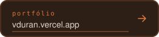</a>
  <a href="https://www.linkedin.com/in/vinicius-duran">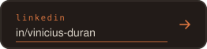</a>
  <a href="https://wa.me/5548992110831">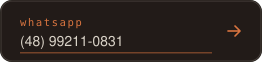</a>

  

  

  <a href="https://github.com/Vinicius-Duran/Finance-front"></a>
  <a href="https://github.com/Vinicius-Duran/toda-produ-es"></a>
  <a href="https://github.com/Vinicius-Duran/Taki"></a>
  <a href="https://github.com/Vinicius-Duran/landpage"></a>
  <a href="https://github.com/Vinicius-Duran/Loja-CSharp"></a>
  <a href="https://github.com/Vinicius-Duran/ViniciusDuranPortifolio"></a>

  

Versão em texto

Uma página só de imagem não se lê num leitor de tela nem numa busca. Cada SVG
acima carrega `role`, `title` e `aria-label`, e o mesmo conteúdo está aqui em
texto puro.

**Vinicius Duran** — Desenvolvedor Full-Stack, Florianópolis/SC.

Trabalho nas três camadas: a interface que as pessoas usam, a API que a sustenta
e o banco onde o dado de fato mora. No front, React com Vite, design system em
CSS custom properties e motion com GSAP e anime.js. No back, C# com ASP.NET Core
e Node com Express, sobre SQL Server ou MySQL.

Projetos em destaque:

| Projeto | O que é | Stack | Código |
|---|---|---|---|
| Sistema Financeiro | CRUD de usuários, centros de custo, receitas, contas e lançamentos, com token e validação | React · Node · MySQL · JWT | [front](https://github.com/Vinicius-Duran/Finance-front) · [back](https://github.com/Vinicius-Duran/Finance-back) |
| Todah Produções | Site institucional e vitrine de artistas de um agenciamento musical | React 19 · Vite 6 · Tailwind | [código](https://github.com/Vinicius-Duran/toda-produ-es) |
| Taki Rastreadores | Site B2B de rastreamento e gestão de frotas, com SEO técnico | HTML · CSS · JS | [código](https://github.com/Vinicius-Duran/Taki) |
| Meta&Marketing | Site de agência de marketing digital, com uma página por serviço | HTML · CSS · JS | [código](https://github.com/Vinicius-Duran/landpage) |
| Loja em C# | Solução .NET 6 em quatro projetos, com domínio e dados isolados da API | C# · ASP.NET · .NET 6 | [código](https://github.com/Vinicius-Duran/Loja-CSharp) |
| Este portfólio | Design system próprio, motion com GSAP e camada de dados separada | React 19 · Vite · GSAP · anime.js | [código](https://github.com/Vinicius-Duran/ViniciusDuranPortifolio) |

Stack:

- **Front** — React · React Native · TypeScript · Vite · CSS/SCSS · Tailwind · GSAP · anime.js
- **Back** — C# · .NET · ASP.NET Core · Node.js · Express · Python · APIs REST
- **Dados** — SQL Server · MySQL · PostgreSQL
- **Plataforma** — Docker · Git · GitHub Actions · Azure · Vercel · Vitest · ESLint

Contato:

- Portfólio — [vduran.vercel.app](https://vduran.vercel.app)
- LinkedIn — [linkedin.com/in/vinicius-duran](https://www.linkedin.com/in/vinicius-duran)
- WhatsApp — [(48) 99211-0831](https://wa.me/5548992110831)

Toda imagem desta página é um SVG deste repositório, animado em CSS, no sistema visual do portfólio: carvão quente, um acento âmbar, grotesk técnica. Nenhuma depende de serviço de terceiro. Os cartões montam uma vez, em vez de repetir em laço, e todos respeitam <code>prefers-reduced-motion</code>. O calendário é redesenhado todo dia por <code>.github/workflows/contrib.yml</code>; os cartões saem de <code>scripts/cards.mjs</code>.
